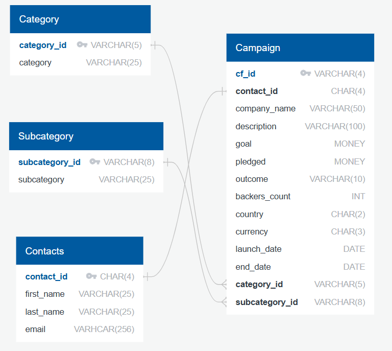

# Crowdfunding ETL Project

## Project Overview

The objective of this project is to build an ETL pipeline using Python, Pandas, and regular expressions to extract and transform data related to a crowdfunding platform. The final goal is to load the transformed data into a PostgreSQL database.

## Project Components

1. **Extract, Transform, and Load (ETL)**
   - Extract data from `crowdfunding.xlsx` and `contacts.xlsx`.
   - Transform the data into structured DataFrames, clean, and manipulate as necessary.
   - Export the transformed data to CSV files: `category.csv`, `subcategory.csv`, `campaign.csv`, and `contacts.csv`.

2. **Entity Relationship Diagram (ERD)**
   - Design and sketch an ERD using QuickDBD based on the transformed data.

3. **Database Schema**
   - Use the ERD to create a PostgreSQL schema (`crowdfunding_db_schema.sql`).
   - Create a PostgreSQL database (`crowdfunding_db`), define tables using the schema, and load data from the CSV files.

## Files

- **Resources**
  - `crowdfunding.xlsx`: Crowdfunding campaign data.
  - `contacts.xlsx`: Contact information for the campaigns.

- **CSV Files**
  - `category.csv`: Crowdfunding campaign categories.
  - `subcategory.csv`: Crowdfunding campaign subcategories.
  - `campaign.csv`: Details of crowdfunding campaigns.
  - `contacts.csv`: Contact information for users.

- **SQL File**
  - `crowdfunding_db_schema.sql`: PostgreSQL database schema.

- **Jupyter Notebook**
  - `ETL_Mini_Project_DOMeara_ALopez_VMadhugiri.ipynb`: The ETL pipeline implementation.

- **ERD**
  - `ERD.png`: Entity relationship diagram.

## Summary of Operations

### Data Extraction & Preparation
- Loaded and previewed `crowdfunding.xlsx` and `contacts.xlsx` using Pandas.
- Extracted and structured data into DataFrames.

### Category & Subcategory Creation
- Split categories and subcategories using string manipulation.
- Created `category.csv` and `subcategory.csv` with unique identifiers.

### Data Cleaning & Formatting
- Renamed and converted columns for consistency, such as:
  - `blurb` to `description`.
  - `launched_at` and `deadline` to `launch_date` and `end_date`.
- Converted `goal` and `pledged` values to float.
- Merged campaign data with `category_df` and `subcategory_df`.

### Campaign DataFrame Creation
- Created `campaign.csv` with necessary columns: campaign identifiers, financial metrics, and dates.
- Included `category_id` and `subcategory_id`.

### Contact Information Parsing
- Cleaned contact data from JSON using Python's `json` module and regex.
- Created `contacts.csv` with columns for `contact_id`, `first_name`, `last_name`, and `email`.

### Data Export
- Exported all DataFrames to CSV:
  - `category.csv`
  - `subcategory.csv`
  - `campaign.csv`
  - `contacts.csv`

These steps ensure that the crowdfunding and contact data are ready for analysis, modeling, or integration into other systems.
